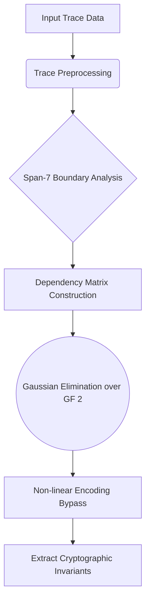

# wbaes-squisher-cryptanalysis


> A novel cryptanalysis toolkit for bypassing White-Box AES encodings via "Squishing" transformations.

## High-Level Overview
White-Box AES implementations attempt to hide cryptographic keys by deeply embedding them within obfuscated lookup tables and non-linear encodings. Standard differential fault analysis (DFA) or BGE attacks can sometimes extract these keys, but they often struggle against complex, intertwined multi-byte encodings.

The **Squisher Cryptanalysis** framework introduces a novel geometric approach to White-Box extraction. By analyzing the input-output dependencies across entire execution blocks (span-7 boundaries), the algorithm "squishes" complex non-linear encodings into lower-dimensional spaces, forcing the hidden cryptographic invariants to reveal themselves mathematically. 

This repository provides the core Rust engine for performing the heavy combinatorial squishing matrix operations, alongside a flexible Go wrapper for integrating the attack against emulated target traces.

## Architecture



## Scientific Foundation
The attack leverages structural weaknesses in composite White-Box tables. If an encoding $E(x)$ maps a byte to an obfuscated state, the Squisher algorithm systematically explores the collision space by injecting targeted inputs and observing the resulting output diffs. By constructing a dependency matrix and performing Gaussian elimination over GF(2), the non-linear components are bypassed entirely.

## Features
- **Massive Span Analysis:** Can resolve encodings spanning multiple S-box boundaries.
- **DCA Integration:** Hooks natively into Differential Computation Analysis (DCA) pipelines.
- **High-Performance Rust Core:** The combinatorial math is accelerated via a native Rust backend.

## Usage
Refer to the provided test suites (e.g., `squisher_attack_test.go`) for examples on how to initialize the engine and feed it trace data.

```go
engine := squisher.NewEngine()
engine.FeedTrace(mockData)
key, err := engine.Extract()
```

## License
This software is provided under the [Blue Oak Model License 1.0.0](LICENSE).

---

## Conceptual Breakdown
Imagine a combination lock where the dials don't have numbers; instead, they have strange symbols. Furthermore, turning one dial randomly shifts three other dials in unpredictable ways (this is what "non-linear encodings" do in software). Traditional lock-picking methods fail because you can't isolate the effect of a single movement.

The **Squisher** method solves this by mapping out every possible relationship between the dials. By aggressively turning them and recording exactly how they interact (building a massive dependency matrix), it uses advanced math to effectively "squish" or cancel out the random shifts. Once the noise is mathematically flattened, the underlying standard combination lock is revealed, allowing us to simply read the combination (the secret key).
